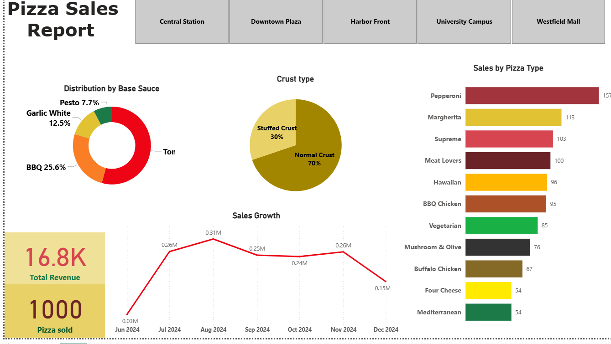

# Pizza Sales Dashboard (Power BI)

This Power BI dashboard analyzes sales data for Pizza Hat. It tracks performance by pizza type, crust, and base sauce while showing total revenue and monthly sales growth trends.

## Objective
To visualize pizza sales performance across branches and categories, helping the business optimize inventory and identify best-selling products.

## Dataset
The dataset includes:
- Branch locations  
- Pizza types, toppings, and sauces  
- Crust type  
- Monthly sales and total revenue  

## Dashboard Overview
The dashboard presents:
- **KPIs**: Total Revenue and Total Pizzas Sold  
- **Sales Breakdown**:  
  - Sales by Pizza Type  
  - Distribution by Base Sauce and Crust Type  
- **Trend Analysis**: Monthly Sales Growth  
- **Branch Filters**: Interactive region buttons for different store locations  

## Tools Used
- Power BI  
- Power Query  
- Microsoft Excel  

## Files
- `Pizza_Sales_Dashboard.pbix` – Power BI file  
- `pizza_sales.xlsx` – dataset used for visualization  
- `Pizza_Sales_Dashboard.png` – dashboard preview  

## How to View
1. Download the `.pbix` file.  
2. Open it in **Power BI Desktop**.  
3. Use branch filters and slicers to explore sales by location or product category.

## Summary
This dashboard provides a quick view of top-performing pizza types and sauces, identifies sales growth trends, and helps inventory teams plan more efficiently based on customer preferences.
