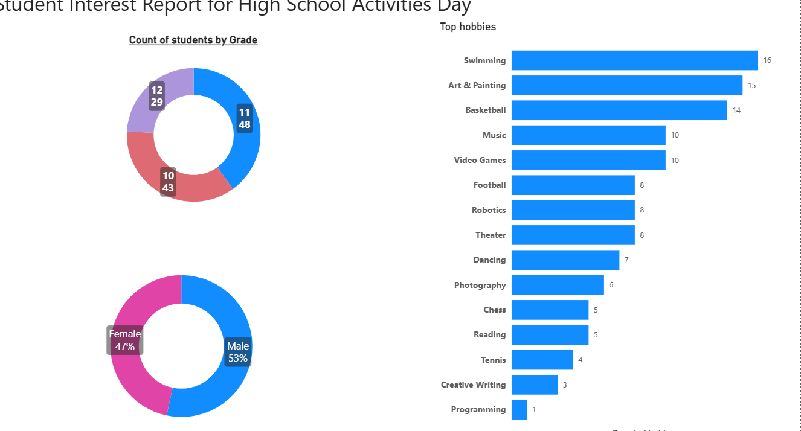

# Student Activities Dashboard (Power BI)

This Power BI dashboard visualizes student interests and participation patterns for Dolphin High School’s activity day. It helps the principal and staff understand student demographics and preferences to plan better activities.

## Objective
To identify trends in student hobbies and participation across grades and gender, enabling tailored activity planning for different student groups.

## Dataset
The dataset includes:
- Student names and grades  
- Gender  
- Preferred activities or hobbies  

## Dashboard Overview
The dashboard highlights:
- Student count by **grade level**  
- Gender distribution (male vs female)  
- **Top hobbies and activities**, ranked by popularity  
- Visuals showing the number of students per interest area  

## Tools Used
- Power BI  
- Power Query  
- Microsoft Excel  

## Files
- `Student_Activities_Dashboard.pbix` – Power BI file  
- `students.xlsx` – dataset used for visualization  
- `HighSchool_Activities_Dashboard.png` – preview image  

## How to View
1. Download the `.pbix` file.  
2. Open it in **Power BI Desktop**.  
3. Use the filters to explore hobbies by grade or gender.

## Summary
The report makes it easier for school administrators to visualize student preferences and gender balance across activity types, helping them design events that better reflect student interests.
